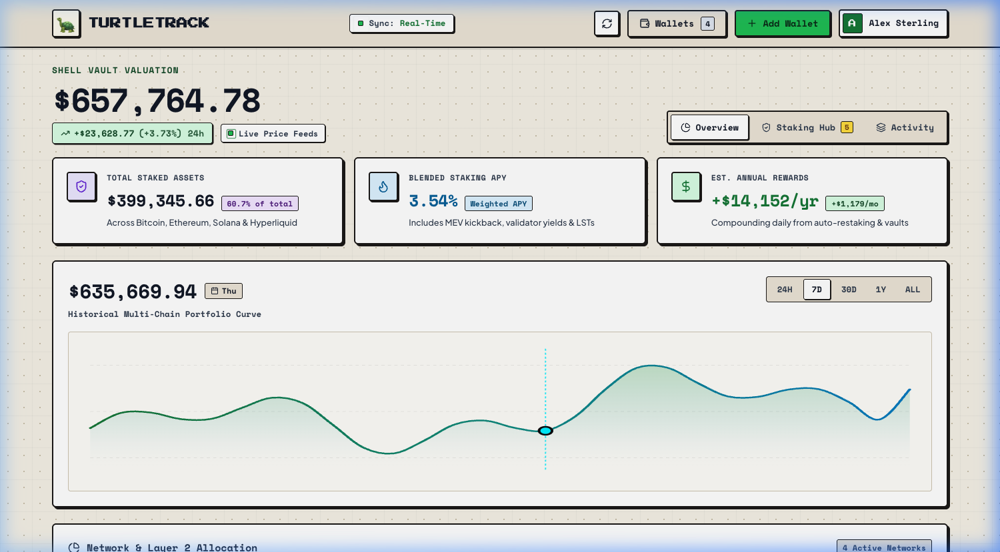

# 🐢 TurtleTrack

> **Slow, steady, sovereign wealth telemetry. Non-custodial cross-chain portfolio and staking tracker.**

<p align="center">
  
</p>

<p align="center">
  <a href="https://hub.docker.com/r/nkgilley/turtletrack"></a>
  <a href="https://github.com/nkgilley/turtle-tracker"></a>
  <a href="https://nodejs.org/"></a>
  
  
</p>

---

## ⚡ Overview

**TurtleTrack** is a lightweight, self-hosted crypto portfolio intelligence dashboard. It connects watch-only addresses across multiple blockchains and exchanges, tracking liquid balances alongside native staking, liquid staking tokens, validator yields, and exchange balances.

- **Zero Cloud Lock-in**: Fully self-hosted with persistent server-side SQLite storage.
- **Cross-Device Sync**: Sign in with an email or Web3 wallet (MetaMask, Rabby, Phantom) to access your saved portfolios from any phone, desktop, or tablet.
- **Clean by Default**: Unauthenticated visitors are greeted with a secure sign-in gateway. New users start fresh at **$0.00** with zero mock data clutter.
- **Non-Custodial & Watch-Only**: Never touches private keys or seed phrases for blockchain addresses. Exchange credentials are stored securely in your own private database.

---

## 🌐 Supported Ecosystems

| Ecosystem | Tracked Assets | Staking & Yield Integrations |
| :--- | :--- | :--- |
| **Bitcoin (BTC)** | Native BTC (Legacy, SegWit, Taproot) | Babylon Protocol, Lombard (`LBTC`), Core Chain LSTs |
| **Ethereum (ETH)** | ETH & ERC-20s across Mainnet & L2s | Native Beacon Validator, Lido (`stETH`), EigenLayer Restaking |
| **Solana (SOL)** | Native SOL & SPL Tokens | Jito MEV Stake (`JitoSOL`), Marinade (`mSOL`), Native Stake |
| **Hyperliquid (HL)** | HYPE Spot & Perps Collateral | HYPE Native Staking (~2.18% APY), stHYPE Liquid Staking (~2.11% APY), HLP Liquidity Pool (~20.4% APY) |
| **Coinbase** | Spot balances via official CDP API | cbETH Staking, cbSOL Staking, USDC Rewards |

---

## 🚀 Quick Start with Docker

Multi-architecture images (`linux/amd64` and `linux/arm64`) are published to Docker Hub at [`nkgilley/turtletrack`](https://hub.docker.com/r/nkgilley/turtletrack).

### Standalone Docker

```bash
docker run -d \
  --name turtletrack \
  --restart unless-stopped \
  -p 8550:80 \
  -v turtletrack-data:/app/data \
  nkgilley/turtletrack:latest
```

Open **`http://localhost:8550`** in your browser.

### Docker Compose

```yaml
services:
  turtletrack:
    image: nkgilley/turtletrack:latest
    container_name: turtletrack
    restart: unless-stopped
    ports:
      - "8550:80"
    volumes:
      - ./data:/app/data
```

```bash
docker compose up -d
```

---

## 🏠 Unraid Home Server Deployment

TurtleTrack includes full automation and GUI template support for Unraid home servers:

1. **Automated One-Click Script**:
   ```bash
   chmod +x deploy-unraid.sh
   ./deploy-unraid.sh
   ```
   *Connects via SSH to your Unraid host, installs the Docker GUI template to `/boot/config/plugins/dockerMan/templates-user/my-turtletrack.xml`, creates persistent appdata at `/mnt/user/appdata/turtletrack/data`, pulls the latest Docker image, and starts the container.*

2. **WebGUI Access**:
   Once deployed, access the dashboard at **`http://tower.local:8550`** (or your server's local IP) or manage it directly from the Unraid **Docker** tab.

---

## 💻 Local Development

Built with **React**, **Vite**, and **Node.js** (utilizing native Node 22 `node:sqlite`).

```bash
# 1. Clone repository
git clone https://github.com/nkgilley/turtle-tracker.git
cd turtle-tracker

# 2. Install dependencies
npm install

# 3. Start local fullstack server (Frontend + SQLite API)
npm run dev
```

Visit `http://localhost:5173`. Any changes to `src/` or `server.js` hot-reload instantly.

```bash
# Build production bundle
npm run build

# Start production server
npm start
```

---

## 🗄️ How the Database Works

TurtleTrack uses Node 22's native **`node:sqlite`** engine with zero external native npm dependencies:

- **Database Location**: Stored in `data/turtletrack.db` (mapped via `/app/data` volume in Docker).
- **WAL Mode**: Write-Ahead Logging (`PRAGMA journal_mode = WAL;`) for high concurrency and zero database locks.
- **Stored Data**:
  - `users`: ID, email/wallet identifier, hashed credentials (PBKDF2-SHA512 + unique per-user salt).
  - `sessions`: High-entropy 256-bit bearer tokens with automated expiration.
  - `wallets`: User ID, chain identifier, public watch address, custom label, cached assets, and encrypted connection metadata.
- **Safety Guards**: Includes server-side hydration guards to prevent accidental empty wallet synchronization or data loss across devices.

---

## 🔒 Security & Privacy

- **100% Watch-Only**: Never asks for or stores private keys or seed phrases for crypto wallets.
- **Zero Third-Party Tracking**: No telemetry, Google Analytics, or third-party user tracking scripts.
- **Air-Gapped Vault Option**: Runs entirely on your local LAN / home server behind your firewall.

---

## 🤖 Built With Gemini & Antigravity

TurtleTrack was architected, coded, and deployed through pair-programming with **Google DeepMind's Gemini** and the **Antigravity** agentic coding platform. From custom multi-chain RPC parsers to Docker containerization and Unraid automation, Antigravity powered the autonomous end-to-end development workflow.

---

## 📄 License

Distributed under the [MIT License](LICENSE).
